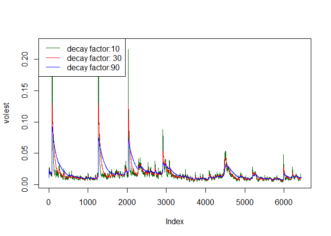

# Unit 9 - 9.5 code
Alex Deshowitz  
July 10, 2016  

* This markdown file will walk through downloading the data, calculating log returns, calculating volatility, and calculing it over the length of the data.  Additionally, this document will provide graphs of the volatility data with 3 different decay factors.

* First, we need to load the required packages


```r
library(tseries)
```

* Download the data


```r
ADP_data<- get.hist.quote(instrument ="ADP",quote = "Close")
```

* Create the log return with 1 period lag


```r
ADP_return<- log(lag(ADP_data))- log(ADP_data)
```

* Create the volatility parameter ( 250 trading days)


```r
ADP_volatility<- sd(ADP_return)*sqrt(250)*100

ADP_volatility
```

```
## [1] 34.49113
```

* We can see that the ADP volatility is 34.49

* Now, we input a function for the volatility


```r
vol<- function(d, logrets){
  var = 0
  lam = 0
  varlist<- c()
  for(r in logrets){
    lam = lam*(1-1/d)+1
  var = (1-1/lam)*var+(1/lam)*r^2
    varlist<- c(varlist,var)
  
  }
sqrt(varlist)
}
```

* Then we create three different volatility curve decay factors


```r
volest<- vol(10,ADP_return)
volest2<- vol(30,ADP_return)
volest3<- vol(90, ADP_return)
```


* finally, we plot the decay factors for the volatility


```r
plot(volest,type = "l", col= "dark green")
lines(volest2, type = "l", col = "red")
lines(volest3, type = "l", col = "blue")

legend( "topleft", lty = 1, col = c("dark green", "red","blue"), c("decay factor:10","decay factor: 30","decay factor:90")) 
```

<!-- -->

* It looks like the lowest decay factor is the most peaked of them all.  The higher the decay, the more smoothed the model tends to look.

